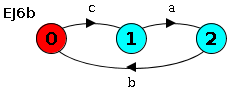

# Ingeniería de Software 2 - Taller 6
### Eric Brandwein

## Ejercicio 2
En este ejercicio decidí crear un subproceso `READ[i:0..N]` que represente
las posibles acciones de la variable al tener almacenado `i`.
La variable puede o leer `i` y seguir en el mismo estado, o escribir
un valor `j` cualquiera entre `0` y `N` y pasar al estado `READ[j]`.

El LTS resultante con `N = 3` es:

## Ejercicio 3

Decidí implementar el `SENSOR` con tres subprocesos principales, según el valor
de la temperatura actual: `SENSOR_NORMAL`, `SENSOR_HIGH`, y `SENSOR_LOW`.
En `SENSOR_NORMAL`, la temperatura sensada puede aumentar o disminuir de a 1,
o puede mantenerse igual. Si aumenta, entonces hace falta fijarse si el valor
actual es mayor a 8. Esto es manejado por el subproceso `CHECK_HIGH[i]`, que solo cuando
`i` es igual a 9 es que emite `high` y pasa al `SENSOR_HIGH`. Si es menor a 9,
pasa de nuevo al `SENSOR_NORMAL`.

`SENSOR_HIGH` permite sensar o una temperatura 9 u 8. Si se sensa 9, se mantiene en
`SENSOR_HIGH`, y sino se pasa a la transición al estado normal, manejado por
`NORMAL_TRANSITION[i]`, que simplemente emite la acción `normal` y pasa a `SENSOR_NORMAL[i]`.
Ocurre algo parecido con `SENSOR_LOW[i]`, que solo puede hacer la transicion
al estado normal si sensa un 2 después de sensar un 1, y sino se mantiene en `SENSOR_LOW`.

El LTS resultante es:

## Ejercicio 4
### a)

### b)

\newpage

## Ejercicio 5

En este ejercicio decidí modelar los primeros procesos lo más simple posibles
siguiendo el enunciado: el proceso `ENTRADA` solo acepta eventos `entry`,
el proceso `SALIDA` solo acepta eventos `exit`, y el `DIRECTOR` solo puede hacer
la secuencia `open->close` y luego esperar al evento `empty`.
`CONTROL` entonces termina teniendo más responsabilidad aparente que los demás
procesos, y eso hace que el LTS de `CONTROL` sea exactamente el mismo que el
de la composición de los 4.

Para implementar `CONTROL`, decidí separarlo en los dos estados del museo:
abierto, o cerrado. `CONTROL` comienza pudiendo emitir un evento `open` para pasar
a `CONTROL_OPEN[x]` con una valor de `x` igual a 0,
que indica que no hay personas dentro. En `CONTROL_OPEN[x]`,
si `x > 0`, está habilitada la acción de `exit`, la cual saca una persona del museo.
Si `x < N`, puede entonces una persona ingresar al museo, lo cual aumenta en
uno la cantidad de personas adentro del museo.
Y en cualquier momento puede cerrar el museo, con lo que el control pasaría al estado
`CONTROL_CLOSE[x]`.

En `CONTROL_CLOSE[x]`, sólo pueden salir personas hasta que se llegue a `x = 0`, y
recién en ese momento puede emitirse el evento `empty`, con el cual se pasa de nuevo
a `CONTROL`, desde el cual se puede abrir de vuelta el museo en otro momento.

Los LTS correspondientes a cada proceso se pueden ver a continuación:

\newpage

## Ejercicio 6

### a)

Se puede ver, al mirar el LTS de `S`, que toda traza se puede crear como
una combinación de la traza `a->c->b` y `c->a->b`. También se podía ver esto
viendo que `P` y `Q` comparten el evento `b`, y por lo tanto cada vez que
ocurra `b` debe haber ocurrido tanto `a` como `c`, los cuales están cada uno antes
que `b` en su proceso correspondiente.

Sabiendo esto, crear el proceso secuencial equivalente es solo tomar la unión de
las dos trazas.

### b)

Yo asumí que el enunciado quería decir que el resultado de la composición debía solo
mantener las trazas de `S` que tuvieran un evento `a` inmediatamente antes de cada aparición
del evento `b`. Para que esto ocurra, debemos mantener las trazas de la forma
`c->a->b`, y eliminar las de la forma `a->c->b`. Podemos lograr esto obligando al evento `a`
a ocurrir siempre después de que haya ocurrido `c`, que es lo que hice con el proceso
`R`, cuyo nombre tuve que cambiar a `REJ6` por un tema de colisión de nombres.

\newpage
### c)

El evento `d`, según entendí, puede o no ocurrir por cada evento `c`. Es decir, podrían
haber dos o más eventos `c` antes de que aparezca una `d`. Por lo tanto,
el proceso `T` debe permitir tanto que aparezca una `d` después de una `c` y antes
de la próxima como que no aparezca.

